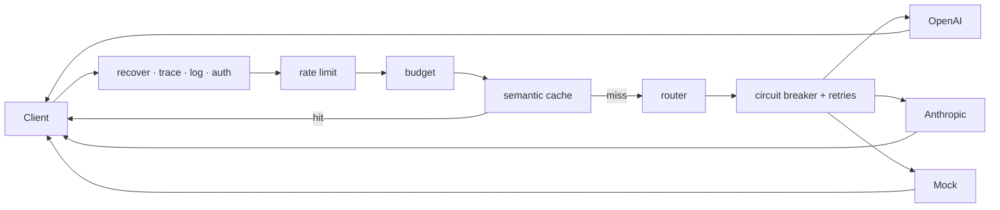

<div align="center">

# 🚰 Sluice

**A high-performance, OpenAI-compatible LLM inference gateway — with semantic caching, smart routing, and full observability.**

[](https://github.com/rishicodes576/sluice/actions/workflows/ci.yml)
[](go.mod)
[](#testing)
[](LICENSE)
[](docs/adr/0003-zero-dependency-core.md)

</div>

Sluice sits in front of your LLM providers and speaks the OpenAI API, so your
existing clients work by changing **one line** — the base URL. In return you get
a semantic cache that cuts cost and latency, resilient multi-provider routing,
per-key rate limits and budgets, and first-class metrics.

It runs **end-to-end with zero API keys**: a built-in deterministic mock
provider and a local embedder let you `docker compose up` and watch semantic
cache hits and Grafana dashboards immediately.

> **Why this exists.** Every serious LLM deployment eventually needs a gateway
> (cost control, failover, caching, observability). Sluice is a compact,
> auditable, from-scratch take on that infrastructure — the Go core has **no
> third-party dependencies** (see [ADR 0003](docs/adr/0003-zero-dependency-core.md)).

## Features

- 🔌 **Drop-in OpenAI API** — `/v1/chat/completions` (streaming + non-streaming),
  `/v1/embeddings`, `/v1/models`.
- 🧠 **Semantic caching** — reuses responses for *meaning*-equivalent prompts via
  a from-scratch **HNSW** vector index; reports hit ratio and USD saved.
- ⚖️ **Smart routing** — round-robin / weighted / **latency (EWMA)** / **cost**
  strategies with automatic failover.
- 🛡️ **Resilience** — per-backend circuit breakers and retries with full-jitter
  exponential backoff.
- 🚦 **Governance** — API-key auth, token-bucket rate limiting, per-key spend and
  token **budgets**.
- 📈 **Observability** — Prometheus metrics, structured logs, request tracing,
  a ready-made Grafana dashboard.
- 🧰 **Batteries included** — TypeScript & Ruby SDKs, Dockerfile, compose stack,
  Helm chart, k6 load test.

## Architecture



See [docs/architecture.md](docs/architecture.md) for the full design and the
[ADRs](docs/adr/) for key decisions.

## Quickstart

### Option A — Docker (full stack, no keys needed)

```bash
cd deploy && docker compose up --build
# Gateway  → http://localhost:8080
# Grafana  → http://localhost:3000  (anonymous admin)
# Prometheus → http://localhost:9090
```

### Option B — Go

```bash
make build
./bin/sluice serve                       # boots with a mock provider
# or with your own config + real providers:
cp config.example.yaml config.yaml
OPENAI_API_KEY=sk-... ./bin/sluice serve --config config.yaml
```

### Try it

```bash
# First call: cache MISS. Repeat it: cache HIT (see the X-Sluice-Cache header).
curl -sD - http://localhost:8080/v1/chat/completions \
  -d '{"model":"mock-1","messages":[{"role":"user","content":"What is the capital of France?"}]}'
```

Or run the scripted demo: `make demo`.

## Using the SDKs

**TypeScript** ([sdk/typescript](sdk/typescript)):

```ts
import { Sluice } from "@sluice/client";
const client = new Sluice({ baseURL: "http://localhost:8080" });
const res = await client.chat({ model: "mock-1", messages: [{ role: "user", content: "hi" }] });
console.log(res.content, "cached:", res.cached);
```

**Ruby** ([sdk/ruby](sdk/ruby)):

```ruby
client = Sluice::Client.new(base_url: "http://localhost:8080")
puts client.chat(model: "mock-1", messages: [{ role: "user", content: "hi" }]).content
```

## Configuration

Configuration is YAML (or JSON) with `${ENV}` expansion; every field has a
default. See [config.example.yaml](config.example.yaml) for the annotated
schema. Highlights:

```yaml
cache: { enabled: true, threshold: 0.95, index: hnsw }
router: { strategy: latency }
providers:
  - { name: openai, type: openai, api_key: ${OPENAI_API_KEY}, models: [gpt-4o] }
  - { name: anthropic, type: anthropic, api_key: ${ANTHROPIC_API_KEY}, models: [claude-sonnet-4-5] }
```

`sluice config-check --config config.yaml` validates without starting.

## Observability

- `GET /metrics` — Prometheus exposition (request rate, latency histograms,
  cache hit ratio, tokens, cost, per-provider EWMA latency).
- `GET /admin/stats` — cache and backend stats as JSON.
- `GET /healthz` / `GET /readyz` — liveness / readiness probes.
- Grafana dashboard: [deploy/grafana/dashboards/sluice.json](deploy/grafana/dashboards/sluice.json).

## Benchmarks

Measured on a laptop (`make bench`); indicative, not a promise:

| Operation | Setup | Result |
|-----------|-------|--------|
| HNSW nearest-neighbour query | 5,000 × 64-dim vectors, `ef=200` | ~1.5 ms/query, ≥0.90 recall@1 |
| Semantic cache hit | in-memory store | microseconds; no upstream call |

## Testing

```bash
make test    # unit + integration (httptest end-to-end)
make race    # race detector
make cover   # aggregate coverage (~89% across internal/)
make bench   # HNSW + router benchmarks
```

The suite spins the real server against the mock provider and asserts semantic
cache hits, streaming, auth, rate limiting and metrics — no network required.

## Project layout

```
cmd/sluice        CLI entrypoint (serve, config-check, version)
internal/         core packages (see docs/architecture.md)
api/openapi.yaml  API contract
sdk/{typescript,ruby}   client SDKs
deploy/           Dockerfile, compose, Helm, Prometheus, Grafana
docs/             architecture + ADRs
test/load.js      k6 load test
```

## Roadmap

- Redis-backed cache store (already behind the `cache.Store` interface).
- Provider-backed embeddings for production-grade semantic recall.
- Full OTLP trace export; request/response logging sinks.
- Prompt/response guardrails and PII redaction hooks.

## License

[Apache-2.0](LICENSE).

---

<sub>Built by <a href="https://github.com/rishicodes576">@rishicodes576</a>. Contributions welcome — see <a href="CONTRIBUTING.md">CONTRIBUTING</a>.</sub>
