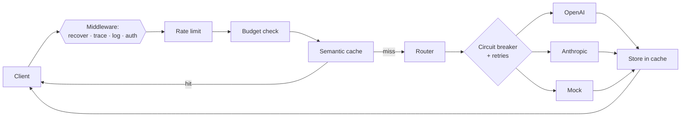

# Architecture

Sluice is a stateless HTTP gateway that sits between your applications and one
or more LLM providers. It speaks the OpenAI API, so existing clients work
unchanged, and adds caching, routing, resilience and observability.

## Request lifecycle

Every hop emits structured logs, Prometheus metrics, and carries a trace id.

## Components (`internal/`)

| Package        | Responsibility |
|----------------|----------------|
| `server`       | Wires config into a running HTTP server; middleware chain; graceful shutdown. |
| `proxy`        | OpenAI-compatible handlers; SSE streaming; request validation; metrics. |
| `router`       | Backend selection (round-robin / weighted / latency-EWMA / cost); failover. |
| `resilience`   | Circuit breaker and retry with exponential backoff + full jitter. |
| `provider`     | `Provider` interface and adapters: `mock`, `openai`, `anthropic`. |
| `cache`        | Semantic cache orchestration; sharded TTL memory store. |
| `vectorstore`  | HNSW approximate NN index (from scratch) + exact brute-force fallback. |
| `embed`        | Embedding interface + dependency-free local vectorizer. |
| `ratelimit`    | Keyed token-bucket limiter. |
| `budget`       | Per-key spend/token caps over rolling windows. |
| `auth`         | API-key authentication; owner propagation via context. |
| `observability`| slog logging, tracing, Prometheus-format metrics registry. |
| `admin`        | Health, readiness, stats, cache purge. |
| `config`       | Schema, defaults, validation, `${ENV}` expansion, in-repo YAML parser. |

## Semantic cache

1. The prompt is embedded to a unit vector (local feature-hashing embedder by
   default; swappable for a provider-backed embedder).
2. The nearest neighbour is looked up in the HNSW index. If cosine similarity
   ≥ `threshold` **and** the stored entry is for the same model, it's a hit.
3. On a miss, the upstream response is stored and indexed for future hits.

Keys are namespaced by model so responses never cross model boundaries. The
cache tracks hit ratio, tokens saved and estimated USD saved.

## Routing & resilience

Backends serving the requested model are ordered by health first, then by the
configured strategy. `latency` uses an exponentially-weighted moving average of
observed upstream latency; `cost` uses configured per-1K pricing. Each backend
has an independent circuit breaker (`closed → open → half-open`) and calls are
wrapped in a retry policy with full-jitter backoff. If a backend is unhealthy or
exhausts retries, the router fails over to the next candidate.

## Why zero third-party Go dependencies

See [ADR 0003](adr/0003-zero-dependency-core.md). In short: a component on the
critical path of production traffic benefits from a tiny, auditable supply chain.
The Prometheus exposition format, YAML config parsing and HNSW are all
implemented in-repo and unit-tested.
